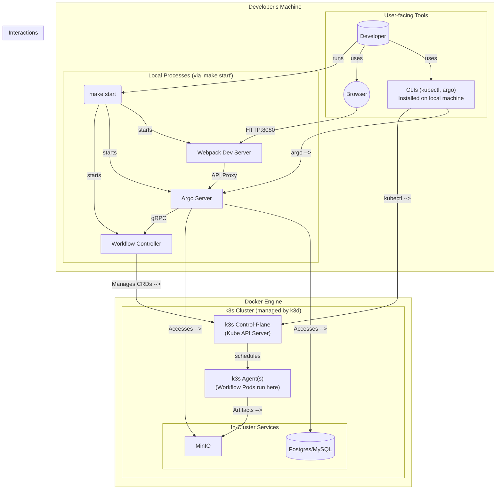

# 첫설정

1. WSL k3d인스톨 https://k3d.io/stable/#installation
2. k3d cluster create k3s-default 로 디폴트 클러스터 생성 
   - `k3d cluster list` 로 클러스터 리스트를 볼수있음 
   - `k3d kubeconfig get k3s-default > $HOME/.kube/k3s-default-config` 로 디폴트설정을 export
   - 참고. 컨텍스트 클러스터는 `kubectl config get-contexts 로 볼수있으며. kubectl이 클러스터에 연결할 때 사용하는 접속 정보 세트 k3d-<클러스터 이름> 형식
3. make devcontainer-up
4. devcontainer exec --workspace-folder . /bin/bash

# 시작하자
- `PATH=$PATH:/root/go/bin make start UI=true`
- `kubectl -n argo port-forward svc/minio 9000:9000`

# 유용한 커맨드 (kubectl)
- `kubectl -n argo get all` - argo 네임스페이스의 모든 리소스를 확인합니다.
- `kubectl -n argo get pods` - argo 네임스페이스의 모든 파드를 확인합니다.
- `kubectl -n argo logs <pod-name>` - 특정 파드의 로그를 확인합니다.
- `kubectl -n argo describe pod <pod-name>` - 특정 파드의 상세 정보와 이벤트를 확인합니다.
- `kubectl get ns` - 모든 네임스페이스를 확인합니다.

## k3d 유용한 커맨드
- `k3d cluster list` - 생성된 클러스터 목록을 확인합니다.
- `k3d cluster create <name>` - 새로운 클러스터를 생성합니다.
- `k3d cluster delete <name>` - 특정 클러스터를 삭제합니다.
- `k3d cluster start <name>` - 중지된 클러스터를 시작합니다.
- `k3d cluster stop <name>` - 실행 중인 클러스터를 중지합니다.
- `k3d node list` - 현재 클러스터의 노드 목록을 확인합니다.
- `k3d kubeconfig get <name>` - 특정 클러스터의 kubeconfig 정보를 가져옵니다.

## Argo CLI Commands

### Workflow Management

- **`argo list`**: 워크플로우 목록을 나열합니다.
  - 예시: `argo list -n argo` ('argo' 네임스페이스의 모든 워크플로우를 나열합니다)
  - 예시: `argo list -n argo --status Succeeded` ('argo' 네임스페이스에서 성공한 워크플로우를 나열합니다)

- **`argo get`**: 특정 워크플로우의 세부 정보를 표시합니다.
  - 예시: `argo get hello-world-4bwkt -n argo` ('argo' 네임스페이스에 있는 'hello-world-4bwkt' 워크플로우의 세부 정보를 가져옵니다)

- **`argo submit`**: 워크플로우를 제출합니다.
  - 예시: `argo submit -n argo my-workflow.yaml` ('my-workflow.yaml'을 'argo' 네임스페이스에 제출합니다)

- **`argo delete`**: 워크플로우를 삭제합니다.
  - 예시: `argo delete -n argo my-workflow` ('argo' 네임스페이스에서 'my-workflow' 워크플로우를 삭제합니다)

- **`argo suspend`**: 하나 이상의 워크플로우를 일시 중단합니다.
  - 예시: `argo suspend -n argo my-workflow` ('argo' 네임스페이스에서 'my-workflow'를 일시 중단합니다)

- **`argo resume`**: 하나 이상의 워크플로우를 다시 시작합니다.
  - 예시: `argo resume -n argo my-workflow` ('argo' 네임스페이스에서 'my-workflow'를 다시 시작합니다)

- **`argo retry`**: 하나 이상의 워크플로우를 재시도합니다.
  - 예시: `argo retry -n argo my-workflow` ('argo' 네임스페이스에서 'my-workflow'를 재시도합니다)

- **`argo resubmit`**: 하나 이상의 워크플로우를 다시 제출합니다.
  - 예시: `argo resubmit -n argo my-workflow` ('argo' 네임스페이스에 'my-workflow'를 다시 제출합니다)

- **`argo stop`**: 하나 이상의 워크플로우를 중지하고 모든 종료 핸들러가 실행되도록 합니다.
  - 예시: `argo stop -n argo my-workflow` ('argo' 네임스페이스에서 'my-workflow'를 중지합니다)

- **`argo terminate`**: 하나 이상의 워크플로우를 즉시 종료합니다.
  - 예시: `argo terminate -n argo my-workflow` ('argo' 네임스페이스에서 'my-workflow'를 즉시 종료합니다)

- **`argo wait`**: 워크플로우가 완료될 때까지 기다립니다.
  - 예시: `argo wait -n argo my-workflow` ('argo' 네임스페이스에서 'my-workflow'가 완료될 때까지 기다립니다)

- **`argo watch`**: 완료될 때까지 워크플로우를 감시합니다.
  - 예시: `argo watch -n argo my-workflow` ('argo' 네임스페이스에서 'my-workflow'를 감시합니다)

### Artifacts and Logs

- **`argo logs`**: 파드 또는 워크플로우의 로그를 봅니다.
  - 예시: `argo logs -n argo hello-world-4bwkt` ('argo' 네임스페이스에 있는 'hello-world-4bwkt'의 로그를 봅니다)

- **`argo cp`**: 워크플로우에서 아티팩트를 복사합니다.
  - 예시: `argo cp -n argo hello-world-4bwkt:/some/path/file.txt ./localfile.txt` (워크플로우에서 로컬 파일로 아티팩트를 복사합니다)

### Templates

- **`argo template`**: 워크플로우 템플릿을 조작합니다.
  - 예시: `argo template create -f my-template.yaml` ('my-template.yaml'에서 워크플로우 템플릿을 생성합니다)

- **`argo cluster-template`**: 클러스터 워크플로우 템플릿을 조작합니다.
  - 예시: `argo cluster-template create -f my-cluster-template.yaml` (클러스터 워크플로우 템플릿을 생성합니다)

### Administration & Utils

- **`argo lint`**: 매니페스트 파일 또는 디렉토리의 유효성을 검사합니다.
  - 예시: `argo lint my-workflow.yaml` ('my-workflow.yaml'의 정확성을 검사합니다)

- **`argo archive`**: 워크플로우 아카이브를 관리합니다.
  - 예시: `argo archive list` (아카이브된 워크플로우를 나열합니다)

- **`argo auth`**: 인증 설정을 관리합니다.
  - 예시: `argo auth whoami` (현재 인증된 사용자를 표시합니다)

- **`argo cron`**: cron 워크플로우를 관리합니다.
  - 예시: `argo cron list -n argo` ('argo' 네임스페이스의 cron 워크플로우를 나열합니다)

- **`argo node`**: 워크플로우의 노드에 대한 작업을 수행합니다.
  - 예시: `argo node get -n argo hello-world-4bwkt my-node` ('hello-world-4bwkt' 워크플로우에 있는 'my-node'의 세부 정보를 가져옵니다)

- **`argo server`**: Argo 서버를 시작합니다.
  - 예시: `argo server` (Argo 서버를 시작합니다)

- **`argo version`**: 버전 정보를 출력합니다.
  - 예시: `argo version` (Argo CLI 버전을 표시합니다)

- **`argo help`**: 모든 명령어에 대한 도움말을 표시합니다.
  - 예시: `argo help submit` ('submit' 명령어에 대한 도움말을 표시합니다)

- **`argo completion`**: 셸 자동 완성 코드를 출력합니다.
  - 예시: `argo completion bash` (bash 자동 완성 스크립트를 생성합니다)

- **`argo executor-plugin`**: 실행기 플러그인을 관리합니다.
  - 예시: `argo executor-plugin list` (사용 가능한 실행기 플러그인을 나열합니다)

# 기초지식

k8s, Minikube, k3s, k3d는 모두 컨테이너 오케스트레이션 도구인 쿠버네티스(Kubernetes)와 관련이 있지만, 각각의 역할과 목적이 다릅니다.

### 1. k8s (쿠버네티스)
- **역할**: 컨테이너화된 애플리케이션을 여러 서버(클러스터)에 걸쳐 자동으로 배포, 확장, 관리하는 **오케스트레이션 시스템의 표준**입니다.
- **비유**: 거대한 오케스트라의 **지휘자**입니다. 수많은 컨테이너(악기)들이 조화롭게 작동하도록 전체를 지휘하고 관리합니다.
- **특징**: 매우 강력하고 확장성이 높지만, 설정이 복잡하고 무겁습니다. 실제 프로덕션 환경에서 주로 사용됩니다.

### 2. Minikube (미니큐브)
- **역할**: 개발자가 자신의 로컬 컴퓨터에서 **단일 노드(Single-Node)의 쿠버네티스 클러스터**를 쉽게 실행할 수 있게 해주는 도구입니다.
- **비유**: 오케스트라의 모든 악기를 혼자서 연주하는 **원맨 밴드**입니다. 완전한 쿠버네티스 환경을 흉내 내지만, 실제 오케스트라(멀티 노드 클러스터)는 아닙니다.
- **특징**: 쿠버네티스 학습이나 로컬 테스트 용도로 적합합니다. 가상 머신(VM) 위에서 동작하기 때문에 k3d/k3s보다 상대적으로 무겁습니다.

### 3. k3s
- **역할**: 쿠버네티스를 **경량화**한 버전입니다. IoT 기기나 엣지 컴퓨팅처럼 리소스가 제한된 환경을 위해 만들어졌습니다.
- **비유**: 대규모 오케스트라(k8s)를 작은 규모의 **실내악단**으로 축소한 것입니다. 핵심 기능은 유지하면서 불필요한 부분은 덜어내어 가볍고 빠르게 만들었습니다.
- **특징**: 공식 쿠버네티스 인증을 받았으며, 바이너리 크기가 작고 메모리 사용량이 적습니다. 설치와 실행이 매우 간단합니다.

### 4. k3d
- **역할**: **k3s를 도커(Docker) 컨테이너 안에서 실행**시켜주는 도구입니다. 즉, 로컬 환경에서 멀티 노드 k3s 클러스터를 손쉽게 생성하고 관리할 수 있게 해줍니다.
- **비유**: 실내악단(k3s)을 공연장(로컬 컴퓨터)에 빠르고 효율적으로 설치하고 해체해주는 **무대 감독**입니다.
- **특징**: 가상 머신(VM) 대신 도커를 사용하므로 Minikube보다 훨씬 가볍고 빠릅니다. 여러 개의 노드를 가진 클러스터를 로컬에서 빠르고 간단하게 테스트하고 싶을 때 매우 유용합니다.

---

**요약:**
- **k8s**: 실제 운영 환경을 위한 거대하고 완전한 오케스트라 지휘자.
- **Minikube**: k8s를 로컬에서 맛보기 위한 무거운 원맨 밴드.
- **k3s**: 리소스가 적은 환경을 위한 가벼운 실내악단.
- **k3d**: 로컬에서 k3s(실내악단)를 쉽게 설치하고 관리해주는 빠른 무대 감독.

# 로컬 개발 아키텍처 (make start)

